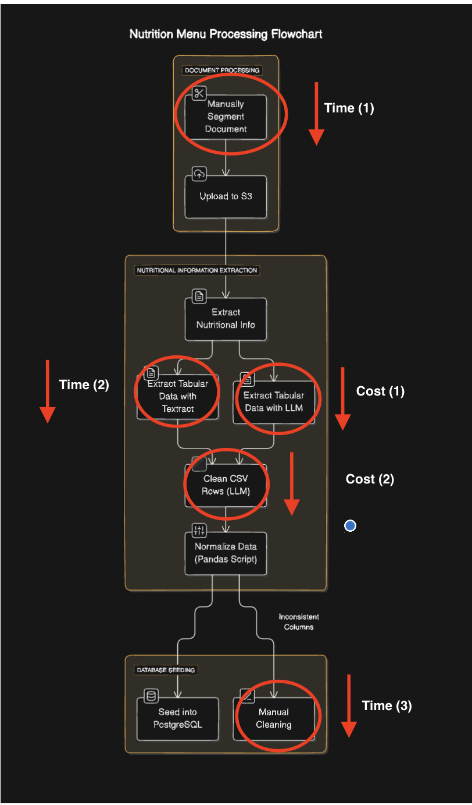

# Hit Your Macros -- Backend

## Introduction

This is the backend repository for Hit Your Macros - an app intends to help you find macro-nutritionally frpipiendly items at restaurants in your vicinity.

## Data Extraction Workflows

Below we will outline the major backend workflows that this repo. contains:

### Workflow As An Image:



## Project Structure

```
Project-folder
  ├── README.md           <- The top-level README for using this project
  ├── .env                <- (You have to make your own env file -- more on this below) ->
  ├── alembic             <- This folder encapsulates migration data
    |   └── versions           <- Each file within this folder represents a migration (i.e changing the db schema)
  ├── data                <- Restaurant Data (mostly post processed data from workflows)
      |   └── cleaned_textract_res_csvs     <- Post Textract script processed files
      |   └── df_reading_anomalies          <- Post Pandas DF Helper function processed files
      |   └── image_to_res_csvs             <- Post GPT script processed fields
  ├── scripts
  |   └── testing           <- Archived, mostly unused testing scripts
  ├── db                  <- Restaurant Data (mostly post processed data from workflows)
      |   └── mapping       <- Mapping between CSV headers which are a subset of DB Table headers
      |   └── models        <- DB SQLAlchemy ORM models
      |   └── queries       <- SQLAlchemy based query functions
      |   └── utils         <- DB Utils (i.e session creation)
      |   └── table_type_mapping.py     <- dictionary mapping types for all tables in db
  ├── clean_textract.py   <- Textract script used to process menu item images in S3
  ├── extract_header.py   <- GPT based script used to extract header as CSV
  ├── gpt_vision_non_tabular_script.py    <- GPT based script for menu items with non-tabular data
  ├── gpt_vision_tabular_script.py    <- GPT based script for menu items with tabular data
  ├── clean_textract.py   <- Processes and cleans individual textract rows
```

## Local Environment Setup

**NOTE:** This project uses Python 3.12. Make sure you have the following installed via homebrew:

```bash
brew install python@3.12.7
brew install postgresql
brew install direnv
```

2. Install and setup the virtual environment using `pipenv sync --dev`

Note: If you have `direnv` installed and would like to have virtualenv installed to the project directory, run `direnv allow .` from the root of the project to have the PIPENV_VENV_IN_PROJECT environment variable set. Run `pipenv --venv` to validate the path to the virtualenv points to the project directory and not somewhere in `$XDG_DATAHOME/virtualenvs` (i.e. `~/.local/share/virtualenvs`).

To install a new package, run `pipenv install <package_name> --dev`

See more about `pipenv` [here](https://pipenv.pypa.io/en/latest/).

### Setting Up Conventional Commits

Ensure you have the latest dependencies installed by running `pipenv sync --dev`.

```bash
pipenv run pre-commit install --install-hooks
```

To run all steps manually outside of a commit: `pipenv run pre-commit run --all-files`.

With this, upon every commit, checks will be run to enforce standardization in file and commit message formats. More can be read about here: https://www.conventionalcommits.org
